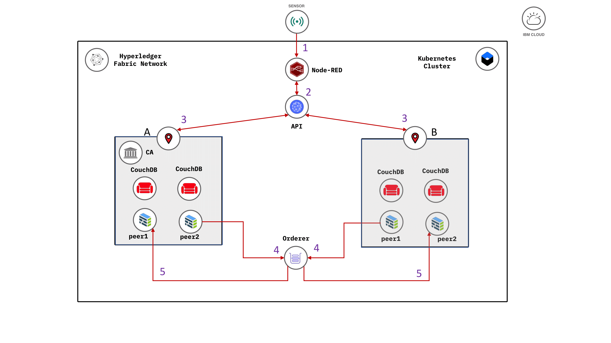

## Key Architecture decisions

## Reference Architecture

Achieve flexibility of developing UI

`insert architecture diagram - example below`

## Description / Definition

## Applicability (or Usage)
Use the UIResponsivness Pattern in a Blockchain use case when .....

* there is a need to xxxxx
* you want a flexible way to .....
* you want more ....

## Example Implementation (Sample Code)

## References

## Credits
